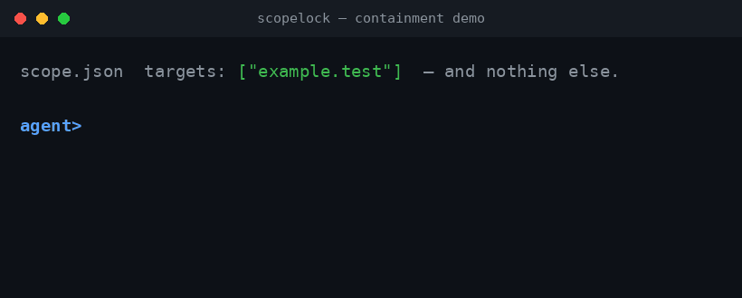

# scopelock

[](https://github.com/CSI-entitymorton/scopelock/actions/workflows/ci.yml)   

**Deterministic containment + tamper-evident proof for autonomous AI agents — enforced in code, fail-closed.**

**Zero npm dependencies — Node stdlib only.**



An autonomous agent is only as trustworthy as the walls around it. `scopelock` is a small
set of primitives, extracted and hardened out of a larger red-team automation harness,
that make one guarantee mechanically true: **an agent cannot act outside its authorized
scope, and every action it takes is recorded in a tamper-evident chain.** Not "the prompt
tells it not to." Not "the model usually behaves." The check happens in code, on every
call, and the default on any uncertain input is *deny*.

This matters for any autonomous or semi-autonomous agent that can execute commands, make
network calls, or otherwise act on the world: coding agents, ops agents, browsing agents,
red-team or blue-team automation, research agents with tool access. `scopelock` is the
containment layer underneath — it does not care what the agent's task is, only whether
the action it is about to take is inside the boundary the operator drew.

## What it is NOT

> `scopelock` contains **no exploits, no C2, no scanners, and no attack code.** It does
> not perform reconnaissance, does not send offensive payloads, and does not talk to any
> target on its own. It is a *containment and proof* layer — a set of gates and ledgers
> that any agentic project can sit behind, regardless of what the agent itself does.
> Everything it enforces is a restriction, not a capability.

## Quickstart

```bash
git clone <repo> && cd scopelock
npm test              # 5/5 hermetic tests, zero network
npm run demo:deny     # out-of-scope command -> BLOCKED, audit chain VERIFIED
npm run demo:allow    # in-scope command     -> ALLOWED
```

Expected output of `npm run demo:deny`:

```
out-of-scope command exit=1  ->  BLOCKED ✋
audit chain verify exit=0  ->  VERIFIED ✓
```

Expected output of `npm run demo:allow`:

```
in-scope command exit=0  ->  ALLOWED ✓
```

No installation step beyond `node`, no external services, no API keys. The demos spin up
a throwaway workspace under the OS temp dir, define a minimal `scope.json` in-process, and
drive the real `src/run.js` gate — nothing is mocked.

## Core primitives

Three groups, fourteen modules. Every module is independently readable (each is a few
hundred lines at most) and has no dependency outside Node's standard library.

### Containment core

| Module | Role |
|---|---|
| `scope-guard` | Single source of truth for "is this target in scope." Fail-closed: an empty, missing, or malformed `scope.json` denies everything rather than allowing it. |
| `ssrf-guard` | Second layer, independent of scope-guard: denies loopback, link-local/cloud-metadata addresses, and other reserved ranges by default, even if scope-guard let the hostname through. |
| `net` | DNS/IP anti-rebinding: resolves a hostname, validates every resolved address against scope, and pins the connection to that address — so a DNS change mid-run can't redirect the request after the check passed. |
| `enforce` | Deterministic dangerous-command scanner: flags destructive or high-impact command patterns before execution, independent of scope. |
| `run` | The execution chokepoint. Every command an agent runs passes through `run` first: scope check, then `enforce` scan, then audit-trail append — *then* (and only then) exec. This is the module everything else defends. |
| `privacy` | Redacts/tokenizes sensitive data (IPs, emails, secrets) at tool output boundaries so it never reaches a downstream model unnecessarily. |
| `proc-registry` | Tracks spawned processes by task id; supports pause/resume/terminate without ever exposing raw-PID kill to the agent. |
| `tool-plane` | Declares and detects the allowed tool surface — an agent can only be routed to a tool that is explicitly registered and present. |

### Proof / tamper-evidence

| Module | Role |
|---|---|
| `audit-trail` | Append-only, hash-chained log of every gated action (genesis → … → tip). Exposes only `append`/`verify`/`show` — no delete, no rewrite. Tampering anywhere in the chain is detectable by `verify`. |
| `oracle` | Mechanical verification: a finding is only treated as real if a machine-generated artifact on disk backs it up — no self-attestation by the model that produced the claim. |
| `evidence-quote` | Requires reality-claiming statements to carry an exact, byte-for-byte quote from a workspace artifact — paraphrase is not evidence. |

### Runaway guards

| Module | Role |
|---|---|
| `budget` | Hard action/token/time budget with fail-closed halt on exhaustion — requires explicit operator reset to resume, never a silent continue. |
| `loop-watch` | Behavioral loop detection over the execution log: flags repeated identical actions (consecutive or windowed) before they burn budget unnoticed. |
| `reflector` | Detects repeated failures of the same tool call and emits a structured recovery prompt instead of letting the agent retry blindly forever. |

## Design

The thesis in one line: **containment and proof must be enforced in code, not in the
prompt.** An LLM-driven agent can be talked out of a instruction; it cannot talk its way
past a `scope.json` it isn't listed in, a hash chain that doesn't verify, or a budget
counter that has already hit zero. Every primitive here follows the same discipline:

- **Fail-closed by default.** Missing config, ambiguous input, or an unrecognized target
  means *deny*, never *allow*. The exceptions (e.g. misconfiguration of an *optional*
  budget file) are documented explicitly in the module that makes them, and even then the
  operator is told, never silently skipped.
- **Defense in depth.** Scope, SSRF, and DNS-pinning are three independent checks that
  each refuse on their own; none of them trusts that "an earlier layer already checked."
- **Mechanical verification over self-report.** Claims of "this happened" or "this is
  real" are only accepted when backed by a verifiable artifact (`oracle`,
  `evidence-quote`) or a verifiable chain (`audit-trail`) — never by the agent
  simply saying so.
- **No hidden state mutation.** The audit trail is append-only by
  construction: the module that writes it exposes no delete/rename primitive at all.

`scopelock` was extracted from a larger red-team automation harness (see Provenance
below) precisely because this containment discipline generalizes: any autonomous agent
with tool access needs the same walls, whether its task is offensive security testing,
coding, ops, or research.

## Beyond security: real use cases

None of the primitives above mention "pentest" — the mechanisms don't care what the agent
is *for*, only that it can act. Here are realistic setups where the same walls earn their
keep:

**Autonomous coding agents (CI / dev sandboxes).** An AI coding agent with shell access
refactors a large repository, installs packages, and runs tests on its own.
`scope-guard` confines it to the repo and the allowed registries; `enforce` refuses
`rm -rf`, `git push --force` and other irreversible commands unless the operator
explicitly unlocks them; `budget` halts it for operator reset once it has burned its
action allowance; and `audit-trail` produces a hash-chained record of everything it
touched, so "what did the agent change?" has a mechanical answer — `verify` detects any
tampering with that record.

**Ops / SRE agents touching production.** An ops agent runs `kubectl`, `terraform`, and
`docker` commands from a chat. The same gates that bound a pentest scope bound an
environment scope: `scope-guard` denies anything outside the approved clusters and
namespaces, `ssrf-guard` stops it from curling internal metadata endpoints,
`loop-watch` catches it retrying the same failing command, and the append-only audit
trail doubles as the change log a compliance review needs.

**Data-pipeline agents over a database.** A bot that turns natural-language requests
into SQL gets `scope-guard` over which schemas and tables it may read, `enforce`
blocking `DROP`, `TRUNCATE`, and bare `DELETE` by default, and `evidence-quote` forcing
any claim like "this query returned 1,204 rows" to carry an exact quote of the executed
query — paraphrase is not proof.

**Browsing / research agents.** An agent that reads the web on your behalf is kept
honest by `ssrf-guard` (no loopback, no cloud-metadata, no link-local) and by `net`'s
DNS pinning (a hostname that starts resolving inside your network mid-run can't
silently redirect the request after the check passed). `privacy` redacts IPs, emails,
and secrets at the output boundary before anything reaches the model; `budget` caps how
much it may spend on a single task.

**Personal / local assistants.** A local assistant with file access is scoped to your
documents directory, denied destructive shell commands, and rate-limited by `budget`;
`proc-registry` lets you pause or kill what it spawns without exposing raw PIDs;
`privacy` keeps your credentials out of its context. Same containment, zero
security-vendor framing.

The through-line: **if an agent can act, the operator needs to bound *where*, cap *how
much*, deny *what is dangerous*, and prove *what happened*.** Whether the action is a
pentest payload, a `kubectl` command, a SQL statement, or a file edit, the mechanism is
the same — and `scopelock` is that mechanism, independent of the task.

## Provenance & license

`scopelock` was created specifically for situations of extreme necessity to follow the
rules — the situation the [stavros-dsh-redteamer](https://github.com/CSI-entitymorton/stavros-dsh-redteamer)
harness lives in. In an authorized red-team engagement there is no room for an agent that
wanders off-script: every action must stay inside the operator's written authorization,
enforced by code rather than by the model's good intentions. `scopelock` is that
enforcement, extracted, hardened and made reusable — the same fail-closed engines the
stavros harness runs on.

Licensed under **Apache-2.0** (see [`LICENSE`](./LICENSE)). See [`NOTICE`](./NOTICE) for
attribution: this project extracts and hardens containment/proof code originally
developed as part of the Redteamingtest project, with portions of the design and
discipline derived from [SeaOf0/dsh-redteam-model](https://github.com/SeaOf0/dsh-redteam-model)
(MIT).

## Security

See [`SECURITY.md`](./SECURITY.md) for how to report a vulnerability.
